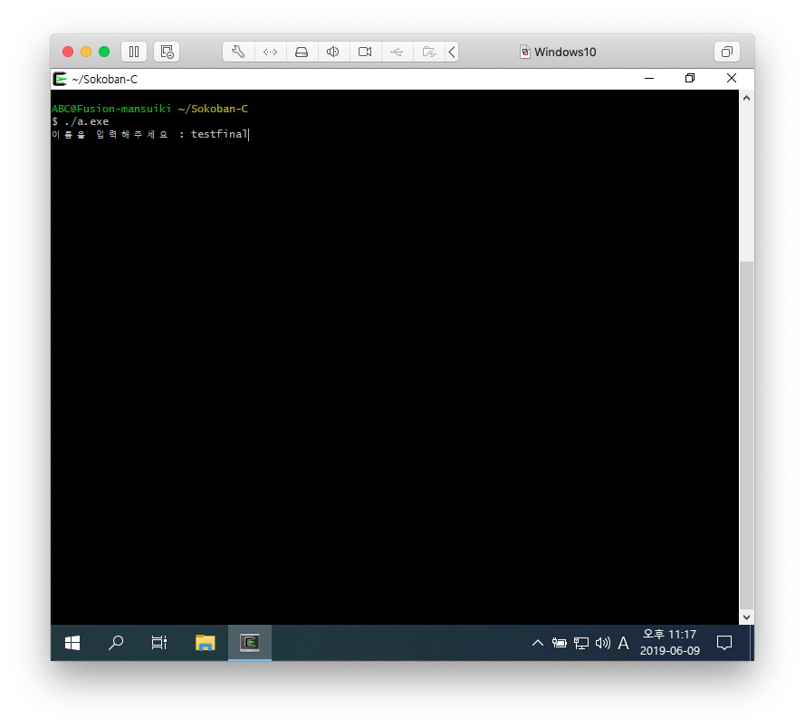
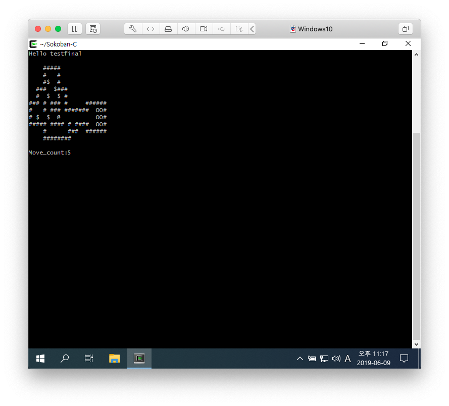
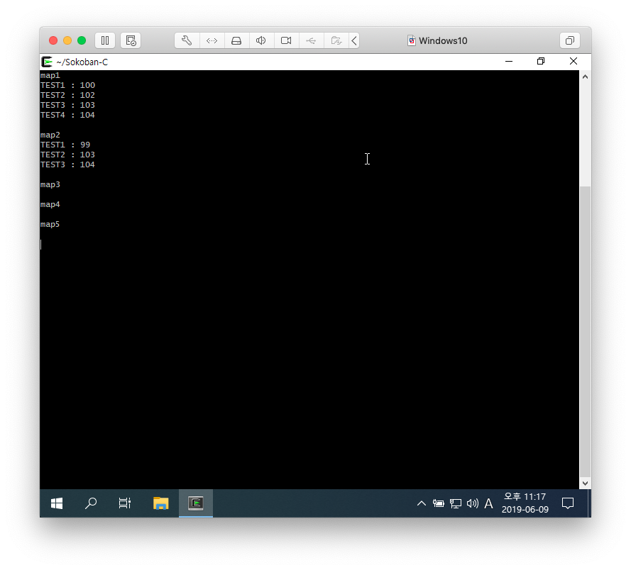

# Sokoban Game With C

제출한 commit: [`be72c7974a7ab25c8d51fa35138da8957d57406d`](https://github.com/mansuiki/Sokoban-C/tree/be72c7974a7ab25c8d51fa35138da8957d57406d)

|  조원   |    학번    |                              Github                               |                          역할                          |
| :---: | :------: | :---------------------------------------------------------------: | :--------------------------------------------------: |
|  김경택  | 20192805 |              [mansuiki](https://github.com/mansuiki)              | load_map, checkXYsize, ranking, save & load, display |
|  김현우  | 20192822 | [qualificationalitated](https://github.com/qualificationalitated) |          check_mapfile, move와 관련된 함수, undo           |
|  이정현  | 20192863 |                 [5d-jh](https://github.com/5d-jh)                 |   get_player_pos, check_goals, move와 관련된 함수, undo    |
|  박민수  | 20192829 |          [parkminsoo99](https://github.com/parkminsoo99)          |            ranking, save & load, display             |

-------
## CheckList
* [x] h(왼쪽), j(아래), k(위), l(오른쪽) : 창고지기 조정
* [x] u(undo) : 최대 5번 할 수 있음
* [x] r(replay) : 현재 맵을 처음부터 다시 시작(움직임 횟수는 계속 유지) 
* [x] n(new) : 첫 번째 맵부터 다시 시작(움직임 횟수 기록 삭제) 
* [x] e(exit) : 게임 종료. 종료하기 전 필요한 정보 저장해야 함
* [x] s(save) : 현재 상태 파일에 저장. 파일 이름은 sokoban으로 하고 다음에 다시 게임을 연속해서 할 수 있도록 모든 상태 저장해야 함
* [x] f(file load) : sokoban 파일에서 저장된 내용을 읽어 save 시점에서부터 이어서 게임하게 함
* [x] d(display help) : 명령 내용 보여줌
* [X] t(top) : 게임 순위 보여줌. t 만 입력하면 전체 순위. t 다음 숫자가 오면 해당 맵의 순위
 
------------------

### 작동 사진

